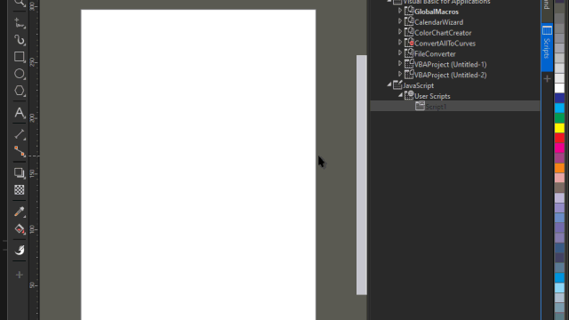

# How use

* Place the PopupHtmlAddon folder in " >CorelDrawPrograms< \Addons"
The name of this folder can be changed, but it is necessary to make the change in the AppUI.xslt file as well
* Place CallForm.js in "%appdata%\Corel\ >CorelVersion< \Draw\Scripts"

> It is highly recommended to change all GUIDs for your final product

## Demo

## Screenshots

